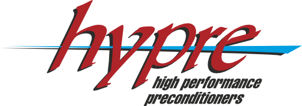

<!--
Copyright 1998-2019 Lawrence Livermore National Security, LLC and other
HYPRE Project Developers. See the top-level COPYRIGHT file for details.

SPDX-License-Identifier: (Apache-2.0 OR MIT)
-->

[HYPRE](http://www.llnl.gov/casc/hypre/) is a library of high performance
preconditioners and solvers featuring multigrid methods for the solution of
large, sparse linear systems of equations on massively parallel computers.

Documentation can be found [here](https://hypre.readthedocs.io/en/latest/).

To install HYPRE, please see either the documentation or the file [INSTALL.md](./INSTALL.md).

An overview of the HYPRE release history can be found in the file [CHANGELOG](./CHANGELOG).

We appreciate feedback from users.  Please submit comments, suggestions, and
issue reports to hypre-support@llnl.gov. See also [SUPPORT.md](./SUPPORT.md).

License
----------------

HYPRE is distributed under the terms of both the MIT license and the Apache
License (Version 2.0). Users may choose either license, at their option.

All new contributions must be made under both the MIT and Apache-2.0 licenses.

See [LICENSE-MIT](./LICENSE-MIT), [LICENSE-APACHE](./LICENSE-APACHE),
[COPYRIGHT](./COPYRIGHT), and [NOTICE](./NOTICE) for details.

SPDX-License-Identifier: (Apache-2.0 OR MIT)

LLNL-CODE-778117

